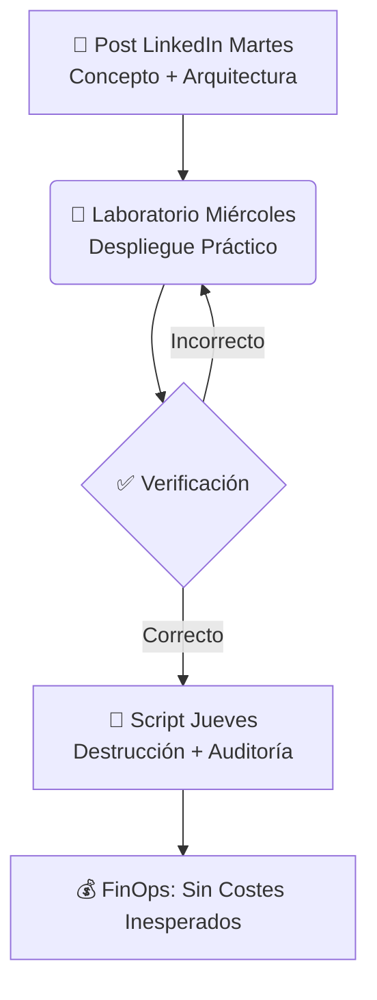

<!-- markdownlint-disable MD033 -->
<p align="center">
  
  
  
  
</p>

<h1 align="center">☁️ Cloud Native Playground</h1>
<p align="center">
  <strong>Laboratorios prácticos, modernos y efectivos para dominar Cloud, DevOps y SRE</strong><br>
  Aprende haciendo con código real, buenas prácticas de seguridad y FinOps proactivo.
</p>

<p align="center">
  <a href="https://linkedin.com/in/jgaragorry"></a>
  <a href="https://github.com/jgaragorry/cloud-native-playground/issues"></a>
  <a href="https://github.com/jgaragorry/cloud-native-playground/discussions"></a>
</p>

---

## 📖 Tabla de Contenidos
- [🎯 Objetivo](#-objetivo)
- [🗺️ Roadmap](#️-roadmap)
- [🚀 Flujo de Trabajo](#-flujo-de-trabajo)
- [🛠️ Requisitos Previos](#️-requisitos-previos)
- [⚙️ Cómo Usar Este Repositorio](#️-cómo-usar-este-repositorio)
- [🧼 Política de Limpieza (FinOps)](#-política-de-limpieza-finops)
- [🤝 Contribuciones y Contacto](#-contribuciones-y-contacto)

---

## 🎯 Objetivo
Este repositorio es el **compañero práctico** de mi serie de publicaciones en LinkedIn. El objetivo es construir autoridad técnica a través de laboratorios que demuestran cómo aplicar las mejores prácticas de la industria en entornos **multi-cloud (AWS/Azure)** usando **Terraform** y **Terragrunt**.

## 🗺️ Roadmap
| Semana | Tema | Estado |
| :--- | :--- | :--- |
| **01** | Bootstrapping del entorno local (WSL2 + Ubuntu + herramientas) | 🟢 **Activo** |
| **02** | Remote backends seguros y cifrados | ⚪ Planificado |
| **03** | Estructuras DRY con Terragrunt | ⚪ Planificado |

## 🚀 Flujo de Trabajo
El flujo de trabajo de nuestros laboratorios es simple pero efectivo. Cada semana, seguimos un ciclo claro que culmina con la destrucción segura de los recursos para evitar costes innecesarios.


---

## 🛠️ Requisitos Previos

- WSL2 con Ubuntu 24.04 LTS (Para usuarios Windows).
- Una cuenta activa en AWS y/o Azure.
- Curiosidad y ganas de aprender haciendo.

## ⚙️ Cómo Usar Este Repositorio

 1. Clona el repositorio en tu máquina local:

```bash
git clone https://github.com/jgaragorry/cloud-native-playground.git
```

2. Navega a la semana que te interesa, por ejemplo:

```bash
cd cloud-native-playground/week-01
```
3. Sigue las instrucciones del laboratorio en la carpeta labs/ correspondiente.

4. Cada publicación de LinkedIn contendrá el enlace directo al laboratorio.

---

## 🧼 Política de Limpieza (FinOps)
La responsabilidad es clave. Todos los recursos desplegados incluyen un script de destrucción (scripts/destroy-all-resources.sh). Como práctica obligatoria, este script debe ejecutarse al finalizar cada laboratorio para:

- Evitar recursos huérfanos.
- Prevenir cualquier facturación inesperada.
- Fomentar una cultura de FinOps proactivo.

---

## 🤝 Contribuciones y Contacto
¿Tienes una sugerencia, idea o encontraste un error? Tu opinión es muy valiosa.

- Abre un Issue en este repositorio.
- Conéctate conmigo en LinkedIn: J. Garagorry.

