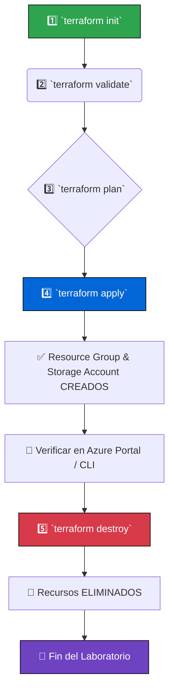

markdown
<!-- markdownlint-disable MD033 -->
<p align="center">
  
  
  
  
</p>

# 🧪 Laboratorio #2: Despliegue de Storage Account en Azure con Terraform

**Objetivo:** Crear un Resource Group y un Storage Account en Azure usando Infrastructure as Code (IaC). Aprenderás a estructurar, planificar, desplegar y destruir recursos de forma segura.

**Duración:** ~20 minutos

**Requisitos previos:**
- ✅ Laboratorio #1 completado (Terraform + Azure CLI instalados y configurados)
- ✅ Ejecutado `az login` y autenticado en Azure
- ✅ Suscripción de Azure activa (Free Tier funciona sin problemas)
- ✅ Repositorio clonado: `git clone https://github.com/jgaragorry/cloud-native-playground.git`

---

## 🗺️ Flujo de Trabajo del Laboratorio

El siguiente diagrama muestra los pasos que seguiremos. La ejecución es un ciclo `Plan -> Apply -> Destroy` para garantizar que no haya costes inesperados.


## 📋 Paso a Paso Quirúrgico
Paso 1: Ir a la carpeta del laboratorio
```bash
cd ~/cloud-native-playground/week-01/labs/azure-simple-storage
```
## Paso 2: Crear tu archivo de configuración personal
```bash
# Copiar el archivo de ejemplo y darle un nombre único
cp terraform.tfvars.example terraform.tfvars
```
Edita el archivo terraform.tfvars y asegúrate de cambiar el nombre del storage_account_name para que sea único a nivel global.

```hcl
resource_group_name   = "rg-cloudnative-lab"
location              = "East US"
storage_account_name  = "stcloudnatvelab1976"  # <-- ¡CÁMBIALO! Usa tu año o iniciales
account_tier          = "Standard"
account_replication_type = "LRS"
```
### Paso 3: Inicializar Terraform
Este comando descarga los plugins necesarios para el proveedor de Azure.

```bash
terraform init
```
✅ Resultado esperado: Mensaje Terraform has been successfully initialized!

### Paso 4: Validar la sintaxis del código
```bash
terraform validate
```
✅ Resultado esperado: Mensaje Success! The configuration is valid.

### Paso 5: Planificar el despliegue (modo sólo lectura)
Revisa qué recursos va a crear Terraform en tu suscripción.

```bash
terraform plan
```
🔍 Acción: Verifica que el plan muestre + create para azurerm_resource_group.lab y azurerm_storage_account.lab.

### Paso 6: Aplicar el despliegue
Ejecuta el plan y crea los recursos en Azure.

```bash
terraform apply -auto-approve
```
✅ Resultado esperado: Apply complete! Resources: 2 added, 0 changed, 0 destroyed.

### Paso 7: Verificar desde Azure CLI
Confirma que los recursos se hayan creado correctamente.

```bash
# Listar el resource group
az group list --query "[?contains(name, 'rg-cloudnative')]" -o table
```

### Ver detalles del storage account (reemplaza el nombre)
```bash
az storage account show --name stcloudnatvelab1976 --resource-group rg-cloudnative-lab
```
### Paso 8: DESTRUIR TODO (¡IMPORTANTE!)
Este paso es obligatorio para evitar costes inesperados.

```bash
terraform destroy -auto-approve
```
✅ Resultado esperado: Destroy complete! Resources: 2 destroyed.

### Paso 9: Verificar la destrucción
Asegúrate de que no haya quedado ningún recurso.

```bash
az group list --query "[?contains(name, 'rg-cloudnative')]" -o table
```
✅ Resultado esperado: La lista debe estar vacía (0 resultados).

### 🧠 ¿Qué has aprendido?

- Estructurar un proyecto Terraform para un solo servicio en Azure.
- Usar variables para hacer tu código limpio y reutilizable (variables.tf).
- Exponer información útil con outputs (outputs.tf).
- Etiquetar recursos para una fácil identificación y gestión de costes.
- Aplicar FinOps desde el primer día, destruyendo siempre lo que creas.

### ⚠️ Mandamientos FinOps para este Laboratorio


| Regla | Por qué |
| :--- | :--- |
| 1. Nunca dejes recursos creados innecesariamente | Un Storage Account, aunque barato, genera un coste continuo. |
| 2. Siempre ejecuta `terraform destroy` | Es la única forma de garantizar que no haya "recursos huérfanos". |
| 3. Verifica con `az group list` | Un segundo par de ojos (el script) ayuda a prevenir sorpresas. |


### 📌 Próximo laboratorio (jueves)
Script de auditoría y destrucción forzosa de recursos (FinOps Proactivo): Automatizaremos la limpieza y generaremos reportes de costes.

🚀 ¿Ya completaste este laboratorio? ¡Cuéntame cómo te fue en los comentarios del post y comparte tu terraform plan!

### Hecho con ☁️ por J. Garagorry


### 🔧 Instrucciones para añadir este runbook a tu repositorio

Ejecuta estos comandos en tu terminal para reemplazar el archivo existente:

```bash
cd ~/cloud-native-playground/week-01/labs/azure-simple-storage
```

# Abre el archivo README.md con un editor (nano, vim, etc.)
```bash
vi README.md
# O usando el comando cat con un here-document como se muestra a continuación
```
### Opción más fácil (usando cat y pegado):

1. Ejecuta cat > README.md << 'EOF'
2. Pega todo el contenido del nuevo runbook (desde <!-- markdownlint-disable MD033 --> hasta Hecho con ☁️ por...)
3. Escribe EOF y presiona Enter.

### 📤 Subir los cambios a GitHub
```bash
cd ~/cloud-native-playground
git add week-01/labs/azure-simple-storage/README.md
git commit -m "docs: actualiza README del lab2 con diagramas y badges modernos"
git push origin main
```
