markdown
<!-- markdownlint-disable MD033 -->
<p align="center">
  
  
  
  
  
  
</p>

# 🧪 RUNBOOK - Laboratorio #2: Despliegue de Storage Account en Azure con Terraform

## 🎯 Objetivo

Este runbook te guía paso a paso para desplegar un **Resource Group** y un **Storage Account** en Azure usando **Terraform con backend remoto seguro**, aplicando mejores prácticas de seguridad, monitoreo y FinOps.

---

## 📊 Diagrama de Flujo del Laboratorio

```mermaid
flowchart TD
    subgraph "Fase 0: Autenticación"
        A[az login --use-device-code] --> B[✅ Autenticado en Azure]
    end

    subgraph "Fase 1: Infraestructura del Backend"
        B --> C[01-create-backend.sh]
        C --> D[Crear Resource Group para estado]
        D --> E[Crear Storage Account cifrado]
        E --> F[Crear contenedor tfstate]
        F --> G[Guardar configuración local]
    end

    subgraph "Fase 2: Configuración"
        G --> H[Configurar terraform.tfvars]
        H --> I[Validar nombre único de Storage Account]
    end

    subgraph "Fase 3: Despliegue"
        I --> J[02-deploy.sh]
        J --> K[terraform init + backend remoto]
        K --> L[terraform validate]
        L --> M[terraform plan]
        M --> N[terraform apply]
        N --> O[✅ Resource Group + Storage Account]
    end

    subgraph "Fase 4: Monitoreo"
        O --> P[03-monitor.sh]
        P --> Q[Listar recursos del laboratorio]
        Q --> R[Verificar estado del backend]
        R --> S[📊 Auditoría completada]
    end

    subgraph "Fase 5: FinOps - Destrucción"
        S --> T[04-destroy-all.sh]
        T --> U[terraform destroy]
        U --> V[Verificar recursos eliminados]
        V --> W[Opción: --delete-backend]
        W --> X[💰 Factura: $0]
    end

    style A fill:#0366d6,stroke:#000,color:#fff
    style C fill:#2ea44f,stroke:#000,color:#fff
    style J fill:#2ea44f,stroke:#000,color:#fff
    style P fill:#6f42c1,stroke:#000,color:#fff
    style T fill:#d73a49,stroke:#000,color:#fff
    style X fill:#2ea44f,stroke:#000,color:#fff
```


## 📋 Tabla de Pasos


| 🔢 Paso | 💻 Script / Comando | 🛠️ ¿Qué hace? | ⏱️ Tiempo |
| :---: | :--- | :--- | :---: |
| **0** | `az login --use-device-code` | Autentica en Azure con modo dispositivo (seguro) | 1 min |
| **1** | `./01-create-backend.sh` | Crea backend remoto (Storage Account cifrado + contenedor) | 30 seg |
| **2** | *Editar `terraform.tfvars`* | Configura nombre único del Storage Account | 1 min |
| **3** | `./02-deploy.sh` | Despliega RG + Storage Account con Terraform | 2 min |
| **4** | `./03-monitor.sh` | Audita recursos desplegados y estado del backend | 10 seg |
| **5** | `./04-destroy-all.sh` | Destruye recursos del laboratorio | 30 seg |
| **6** | `./04-destroy-all.sh --delete-backend` | Destruye también el backend remoto | 30 seg |


## 🚀 Paso a Paso Detallado
## 🔐 Paso 0: Autenticación en Azure
```bash
az login --use-device-code
```
### 🔐 Autenticación en Azure CLI


| 📋 Atributo | 📝 Descripción |
| :--- | :--- |
| **Qué hace** | Inicia sesión en Azure usando autenticación por dispositivo |
| **Por qué** | Más seguro que métodos con contraseña, no expone credenciales |
| **Qué esperar** | Código de 9 letras → abrir `https://microsoft.com/devicelogin` → ingresar código |
| **Resultado** | ✅ Mensaje `"You have logged in"` con lista de suscripciones |


### 🏗️ Paso 1: Crear el Backend Remoto
```bash
./scripts/01-create-backend.sh
```
### 🔑 Detalles de la Creación del Backend

| 📋 Atributo | 📝 Descripción |
| :--- | :--- |
| **Qué hace** | Crea infraestructura dedicada para el archivo de estado de Terraform |
| **Recursos creados** | Resource Group + Storage Account (TLS 1.2) + Contenedor |
| **Por qué** | El estado remoto permite colaboración, cifrado y versionado |
| **Seguridad** | HTTPS forzado, TLS 1.2 mínimo y sin acceso público a blobs |
| **Output** | Configuración guardada en `~/.terraform-backend/lab2-backend-config` |
| **Resultado** | ✅ Backend creado: `tfstateXXXXXX2026` |


### ⚙️ Paso 2: Configurar Variables del Despliegue
```bash
cp terraform.tfvars.example terraform.tfvars
vi terraform.tfvars
```
### 📝 Configuración de Variables del Laboratorio

| 📋 Atributo | 📝 Descripción |
| :--- | :--- |
| **Qué hace** | Crea archivo de variables con valores específicos para tu despliegue |
| **Variable clave** | `storage_account_name` → debe ser **ÚNICO global** |
| **Formato** | `stcloudnatvelabYYYY` (usar año + iniciales + número) |
| **Por qué** | No versionamos `.tfvars` reales (contienen datos específicos) |
| **Resultado** | ✅ Archivo `terraform.tfvars` listo para usar |


Ejemplo de terraform.tfvars:

```hcl
resource_group_name   = "rg-cloudnative-lab"
location              = "East US"
storage_account_name  = "stcloudnatvelab2026"
account_tier          = "Standard"
account_replication_type = "LRS"
```

### 🚀 Paso 3: Desplegar Recursos
```bash
./scripts/02-deploy.sh
```
### 🚀 Detalles del Despliegue

| 📋 Atributo | 📝 Descripción |
| :--- | :--- |
| **Qué hace** | Ejecuta el ciclo completo de Terraform (`init` → `validate` → `plan` → `apply`) |
| **Verificaciones** | Backend configurado, autenticación activa y sintaxis válida |
| **Recursos creados** | `azurerm_resource_group.lab` + `azurerm_storage_account.lab` |
| **Outputs** | Muestra nombres, IDs y endpoints creados |
| **Monitoreo automático** | Ejecuta `03-monitor.sh` al finalizar |
| **Resultado** | ✅ `Apply complete! Resources: 2 added, 0 changed, 0 destroyed` |


### 📊 Paso 4: Monitorear Recursos
```bash
./scripts/03-monitor.sh
```

### 📊 Detalles del Monitoreo

| 📋 Atributo | 📝 Descripción |
| :--- | :--- |
| **Qué hace** | Audita todos los recursos relacionados con el laboratorio |
| **Qué lista** | Backend remoto y recursos etiquetados con `Lab=week-01-lab2` |
| **Estado del backend** | Muestra Storage Account, contenedor y archivo de estado |
| **Por qué** | Verificar que el despliegue fue exitoso antes de destruir |
| **Resultado** | ✅ Total de recursos activos del laboratorio: 2 |


### 🧹 Paso 5: Destruir Recursos (FinOps)
```bash
./scripts/04-destroy-all.sh
```
### 🔄 Detalles de la Destrucción

| 📋 Atributo | 📝 Descripción |
| :--- | :--- |
| **Qué hace** | Destruye **SOLO** los recursos del laboratorio (NO el backend) |
| **Verificación pre-destrucción** | Ejecuta monitor para mostrar qué se va a eliminar |
| **Espera** | 5 segundos para cancelar si es necesario |
| **Post-verificación** | Confirma que no quedaron recursos huérfanos |
| **Resultado** | ✅ `Destroy complete! Resources: 2 destroyed` |


### 🗑️ Paso 6: Destruir también el Backend (Opcional)
```bash
./scripts/04-destroy-all.sh --delete-backend
```
### 🗑️ Detalles de la Destrucción

| 📋 Atributo | 📝 Descripción |
| :--- | :--- |
| **Qué hace** | Además de destruir el laboratorio, elimina el backend remoto |
| **Recursos afectados** | Elimina Resource Group del backend + Storage Account + archivo de estado |
| **⚠️ Advertencia** | **No podrás recuperar el estado anterior** |
| **Resultado** | ✅ Backend remoto eliminado (en segundo plano) |


### 🛡️ Buenas Prácticas Implementadas


| ⚙️ Práctica | 🛠️ Cómo se aplica |
| :--- | :--- |
| **Backend remoto** | Estado almacenado en Azure Storage con bloqueo de estado |
| **Cifrado** | Cifrado en reposo por defecto en Storage Account |
| **TLS mínimo** | `--min-tls-version TLS1_2` |
| **HTTPS forzado** | `--https-only true` |
| **Sin acceso público** | `--allow-blob-public-access false` |
| **Variables externas** | Secrets nunca en código (`.tfvars` ignorado por git) |
| **Etiquetado** | Tags para identificar recursos del laboratorio |
| **Idempotencia** | Scripts verifican condiciones antes de actuar |
| **FinOps** | Destrucción controlada + verificación post-eliminación |


### 📁 Estructura del Laboratorio
text
azure-simple-storage/
├── scripts/
│   ├── 01-create-backend.sh   # Crea backend remoto seguro
│   ├── 02-deploy.sh           # Despliega recursos
│   ├── 03-monitor.sh          # Audita y monitorea
│   └── 04-destroy-all.sh      # Destrucción controlada
├── backend.tf                  # Configuración de backend (sin valores)
├── main.tf                     # Recursos principales
├── variables.tf                # Variables configurables
├── outputs.tf                  # Outputs útiles
├── terraform.tfvars.example    # Ejemplo (seguro para versionar)
└── README.md                   # Documentación del laboratorio

### ⚠️ Posibles Errores y Soluciones


| 🛑 Error | 🔍 Causa | 💡 Solución |
| :--- | :--- | :--- |
| **Please run 'az login'** | No autenticado | Ejecutar `az login --use-device-code` |
| **Storage account name must be unique** | Nombre repetido | Cambiar nombre en `terraform.tfvars` |
| **Backend configuration changed** | Backend ya existe | Ejecutar `terraform init -reconfigure` |
| **Permission denied en scripts** | Script no ejecutable | `chmod 750 scripts/*.sh` |
| **No backend config found** | No se creó backend | Ejecutar **Paso 1** primero |


### ✅ Checklist de Validación

- az login exitoso
- 01-create-backend.sh completado
- terraform.tfvars configurado con nombre único
- 02-deploy.sh muestra "Apply complete! Resources: 2 added"
- 03-monitor.sh muestra 2 recursos activos
- 04-destroy-all.sh muestra "Resources: 2 destroyed"
- az resource list --tag "Lab=week-01-lab2" devuelve 0
- (Opcional) Backend eliminado con --delete-backend

### 🏁 Al Finalizar
Escenario	Resultado
Solo laboratorio destruido	Backend remoto conservado (reutilizable)
Laboratorio + backend destruido	Todo limpio, factura $0
Recursos no destruidos	Ejecutar 04-destroy-all.sh nuevamente

### 📚 Recursos Adicionales

- 📦 Repositorio oficial
- 🔗 Documentación de Terraform AzureRM
- 📖 Azure CLI Reference

### Hecho con ☁️ por J. Garagorry
